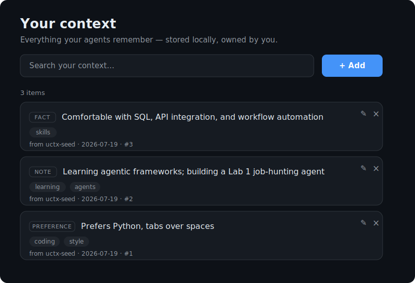

# uctx — your context, not the vendor's

**A local, user-owned memory that you fill once and every AI agent can read.**

Today each assistant keeps its own siloed memory. Tell Claude you prefer Python;
ChatGPT still has no idea. `uctx` is a tiny [MCP](https://modelcontextprotocol.io)
server backed by a **local SQLite file you own** — so the *same* context is
readable and writable by any MCP-enabled agent (Claude Desktop, Cursor, …).

No cloud. No account. The data is a file on your machine (`~/.uctx/context.db`).

```
   Claude Desktop ┐
                  ├──► uctx (MCP server) ──► ~/.uctx/context.db   ← you own this
   Cursor        ┘
```

## The 30-second demo

1. In **Claude Desktop**: *"Remember that I prefer Python, tabs over spaces, and I'm learning agentic frameworks."*
   → it calls `save_context`.
2. In **Cursor** (or a fresh Claude chat): *"What do you know about my coding preferences?"*
   → it calls `search_context` and answers correctly.

Two different agents, one shared memory you control. That's the whole idea.

## Or run the demo right now (no agent setup)

```bash
uv sync
uv run python examples/two_agents_demo.py
```

```text
Agent A = 'claude-desktop'  — saves what the user tells it:
  [claude-desktop] save_context('Prefers Python, tabs over spaces') -> Saved context #1
  [claude-desktop] save_context('Based in Boston')                  -> Saved context #2
  [claude-desktop] save_context('Learning agentic frameworks')      -> Saved context #3

---- Switch apps. Brand-new agent, same local store, no shared chat. ----

Agent B = 'cursor'  — recalls it without ever seeing the above:
  [cursor] search_context('coding')
        -> #1 [preference] Prefers Python, tabs over spaces  ·tags: coding style  ·from claude-desktop
=>  Two different agents. One context you own.
```

Two separate MCP clients, one local store — the cross-app share, proven in one command.

## Install

Requires Python 3.10+ and [uv](https://docs.astral.sh/uv/).

```bash
git clone https://github.com/<you>/uctx.git
cd uctx
uv sync
uv run uctx        # starts the MCP server (Ctrl-C to stop)
```

## Wire it into your agents

### Claude Desktop
Edit `claude_desktop_config.json` (Settings → Developer → Edit Config) and add:

```json
{
  "mcpServers": {
    "uctx": {
      "command": "uv",
      "args": ["--directory", "/ABSOLUTE/PATH/TO/uctx", "run", "uctx"]
    }
  }
}
```

Restart Claude Desktop. You'll see the `uctx` tools appear.

### Cursor
Add the same server under **Settings → MCP → Add** (command `uv`, args
`--directory /ABSOLUTE/PATH/TO/uctx run uctx`). Point it at the **same folder**
as Claude and they share one store.

## Web UI — see & manage your context



A local dashboard for the same store your agents use — view, search, add, **edit**,
and delete anything, so you can *see* what's been remembered about you (and change
what shouldn't be).

```bash
uv run uctx-web        # then open http://127.0.0.1:8787
```

Reads/writes the same `~/.uctx/context.db`. Localhost-only, single-user.

## Tools

| Tool | What it does |
|------|--------------|
| `save_context(content, type, tags, source_app)` | Remember a preference / fact / note |
| `search_context(query, limit)` | Keyword-search saved context |
| `list_context(limit)` | List everything, most recent first |
| `forget_context(item_id)` | Delete one item |

## The v0 schema (small on purpose)

```json
{
  "id": 1,
  "type": "preference | fact | note",
  "content": "Prefers Python, tabs over spaces",
  "tags": "coding style",
  "source_app": "claude-desktop",
  "created_at": "2026-07-19T..."
}
```

`source_app` + `created_at` are the seed of *provenance* — so trust and
versioning can be added later without a migration.

## Deliberately NOT in v0 (the roadmap)

These are the genuinely hard parts, and they come only if people actually use v0:

- **Semantic search** (embeddings) instead of keyword `LIKE`
- **Provenance / signing** — verify who wrote a memory
- **Temporal validity** — facts that expire or get superseded
- **Access control** — per-app read/write scopes, revocation
- **Multi-user / identity**

## Why local-first

Portable, user-owned context is something the big labs are structurally
disinclined to build — your memory is their lock-in. `uctx` keeps the data in a
file you own, and moves it *between* vendors instead of trapping it inside one.

## Status

Early prototype. Built to find out one thing: **does anyone actually reach for
this once the novelty wears off?** If that's you — open an issue and tell me what
you'd want next.

MIT licensed.
